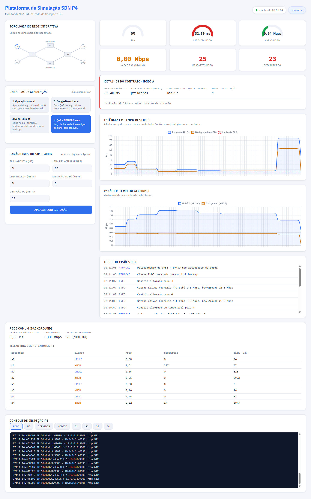

# Sistema de monitoramento e controle para aplicações sensíveis à latência

Trabalho final da disciplina de Redes de Computadores — Mestrado em Tecnologia
da Informação, IFPB Campus João Pessoa.

A ideia é simular uma rede SDN com plano de dados programável em P4 (BMv2),
emulada no Mininet, e um laço de controle fechado em Python que garante o
SLA de 5 ms de latência fim-a-fim para o tráfego uRLLC. O cenário concreto
usado como pretexto é um robô cirúrgico num hospital se comunicando com o
servidor de controle e o médico em outro hospital.

---

## 1. Cenário e topologia

```
        Rede A                    Rede de Transporte                Rede B
                              +--------- s2 ---------+        (link principal)
   Robô A --+                 |                      |               +-- Servidor
            +---- s1 ---------+                      +---- s4 ------+
   PC A   --+                 |                      |               +-- Médico
                              +--------- s3 ---------+        (link de backup)
```

| Nó         | IP        | Papel                                        |
|------------|-----------|----------------------------------------------|
| `robo`     | 10.0.0.1  | Robô cirúrgico, gera tráfego uRLLC            |
| `pc`       | 10.0.0.2  | Estação clínica, gera tráfego eMBB            |
| `servidor` | 10.0.0.3  | Servidor de controle do robô (Rede B)         |
| `medico`   | 10.0.0.4  | Console do médico (Rede B)                    |
| `s1`–`s4`  | —         | Os 4 roteadores da rede de transporte, em P4  |

Os quatro switches rodam o mesmo `p4/urllc.p4`. `s1` e `s4` são os roteadores
de borda — é neles que o controlador troca o caminho (principal x backup) e
aplica o policiamento.

---

## 2. Divisão de responsabilidades

| Camada | Ferramenta | O que faz |
|---|---|---|
| Plano de dados | P4 / BMv2 | Classifica uRLLC x eMBB pelas portas TCP, marca DSCP, escolhe a fila de prioridade e a porta de saída (principal/backup), descarta o eMBB quando policiado e mantém contadores de telemetria |
| Plano de controle | Python + Thrift | Instala as regras base, lê a latência medida, decide e reescreve as tabelas do P4 em tempo real, com histerese |
| Emulação | Mininet + TCLink | Topologia, banda, atraso e fila de cada enlace; queda e retorno de links |
| Medição | Scapy | Sonda TCP com número de sequência e timestamp no payload, refletida do outro lado; latência = RTT/2 |
| Carga de fundo | iperf3 (ou ffmpeg) | Tráfego eMBB volumoso disputando o link |
| Visualização | Flask + Chart.js | Painel com gauges, gráficos ao vivo, diagrama clicável, log de decisões e console de tcpdump |

Por que a limitação de banda não fica no P4: o BMv2 é um switch de software
e o modelo de fila dele não reproduz bem a serialização de um link real.
Deixei a banda e o atraso no `tc`/TCLink do Mininet (que é o comportamento
físico do enlace) e o P4 cuida só do que é decisão de rede — classificar,
priorizar, rotear, descartar. Essa separação ajuda bastante a defender os
resultados no artigo.

---

## 3. Instalação (Ubuntu 22.04)

```bash
git clone https://github.com/josenildobento-cloud/projeto-urllc-sdn.git projeto-urllc-sdn
cd projeto-urllc-sdn
bash instalar.sh          # p4c, BMv2, Mininet, iperf3, Scapy, Flask
bash p4/compilar.sh       # gera p4/build/urllc.json
```

## 4. Execução

### Modo simples: `simulador.sh`

Um comando só sobe topologia + BMv2 + controlador em segundo plano, e o
painel junto:

```bash
bash simulador.sh start          # cenário 1 por padrão
bash simulador.sh start 4        # ou direto no cenário 4
bash simulador.sh status         # o que está rodando
bash simulador.sh stop           # encerra tudo e limpa o Mininet
```

Depois é só abrir `http://localhost:5000`. Dá pra trocar de cenário direto
no painel (seção "Cenários de Simulação") sem reiniciar nada, e os
parâmetros (SLA, banda dos links, taxa de geração) também são ajustáveis por
lá (seção "Parâmetros do Simulador"). Os logs ficam em
`/tmp/painel_sdn/{topologia,painel}.log`.
[](./print_simulador2.png)


### Modo manual (dois terminais)

Útil quando você quer usar o prompt interativo do Mininet (`link s1 s2 down`
etc):

```bash
sudo python3 topologia/topologia.py \
    --cenario 4 \
    --banda-principal 10 \
    --banda-backup 5 \
    --limite-robo 2 \
    --limite-background 20 \
    --limiar-ms 5
```

```bash
python3 painel/servidor.py       # http://localhost:5000
```

Pra encerrar: `exit` no prompt do Mininet, e se travar, `bash simulador.sh
stop` (ou `sudo mn -c`).

### Bateria de experimentos

```bash
sudo bash experimentos/executar_todos.sh 90
```

Roda os quatro cenários por 90s cada e deixa em `resultados/` os CSVs de
série temporal, os resumos estatísticos e os logs de decisão — que é
basicamente o insumo pra seção de Avaliação do artigo.

---

## 5. Os quatro cenários

| # | Nome | Configuração | O que deve acontecer |
|---|---|---|---|
| 1 | Operação normal | Roteamento estático pelo principal, sem QoS, sem laço fechado, sem fundo | Latência do robô bem abaixo de 5 ms — é a linha de base |
| 2 | Congestão extrema | eMBB a 20 Mbps num link de 10 Mbps, sem QoS e sem atuação | A fila do principal satura, a latência do robô estoura o SLA e tem perda. É o problema |
| 3 | Congestão com auto-reroute | uRLLC no principal, eMBB desviado estaticamente pro backup | A latência do robô volta ao normal; o eMBB paga o preço (backup mais lento) |
| 4 | QoS + SDN dinâmico | Laço fechado ativo com escalonamento | O sistema descobre a violação e reage sozinho, e sobrevive à queda do link principal |

### Escalonamento de atuações no cenário 4

```
nível 0  QoS base ....... uRLLC na fila 7, eMBB na fila 1
   ↓ latência > 5 ms
nível 1  Reroute ........ eMBB desviado pro link de backup
   ↓ latência ainda > 5 ms
nível 2  Policiamento ... eMBB descartado no ingresso de s1 e s4
   ↑ 6 amostras consecutivas abaixo de 3,5 ms (70% do limiar)
       relaxa um nível
```

A histerese (sobe na primeira violação, desce só depois de 6 amostras boas)
evita ficar oscilando de regra em regra — vale um parágrafo na Metodologia.

### Falha de enlace

Com o cenário 4 rodando, dá pra derrubar o link principal de três jeitos:

- clicando no enlace `s1—s2` no diagrama do painel;
- no prompt do Mininet: `link s1 s2 down`;
- por HTTP: `curl http://localhost:8090/enlace/s1/s2/down`.

O controlador detecta em até 500 ms e migra as duas classes pro backup,
registrando um evento `alerta` no log de decisões.

---

## 6. Calibração do limiar — leia antes de rodar

O BMv2 é um switch de software: cada salto adiciona algo entre 0,2 ms e 1 ms
de processamento, e o caminho robô → servidor passa por três switches. Vale
medir a linha de base antes de defender qualquer número:

```bash
sudo python3 topologia/topologia.py --cenario 1
# espera uns 20s e, em outro terminal:
python3 experimentos/consolidar.py --cenario 1
```

- Se a latência média do cenário 1 ficar em torno de 1–3 ms, mantém
  `--limiar-ms 5` e o SLA do enunciado vale literalmente.
- Se passar de 4 ms, o overhead do emulador já está consumindo o orçamento.
  Duas saídas honestas: reduzir `--atraso-principal` pra `0.1ms`, ou adotar
  um limiar escalado (tipo `--limiar-ms 15`) e declarar isso na Metodologia
  como fator de escala do ambiente emulado. Não é falha do projeto, é
  limitação do emulador — e reconhecer isso na banca costuma valer mais do
  que forçar um número bonito sem explicação.

Outras alavancas de latência: `max_queue_size` dos enlaces em
`topologia/topologia.py` (200 pacotes por padrão) e o tamanho do pacote da
sonda (`--tamanho-pacote`, 512 B).

---

## 7. O painel

| Área | Conteúdo |
|---|---|
| Cenários de Simulação | Cartões clicáveis (1 a 4) pra trocar o cenário ativo em tempo real |
| Parâmetros do Simulador | Formulário pra ajustar SLA, banda dos links e taxa de geração de robô/PC |
| Indicadores (topo) | Gauges de SLA, latência e vazão do robô, mais vazão de background e descartes |
| Contrato (detalhes) | p95, caminho ativo de cada classe, nível de atuação e motivo da última decisão |
| Latência em tempo real | Série do robô e do fundo, com o limiar tracejado |
| Throughput em tempo real | Vazão das duas classes em Mbps |
| Diagrama da rede | SVG clicável; links caídos ficam vermelhos e tracejados; formulário pra conectar novos nós |
| Rede comum | Indicadores do eMBB + tabela de telemetria dos registradores P4 |
| Decisões SDN | Log ao vivo, com nível info, atuacao ou alerta |
| Console de inspeção P4 | tcpdump contínuo de cada nó, uma aba por nó |

O painel só lê arquivo: o controlador publica `estado_painel.json` a cada
500 ms e vai acrescentando linhas em `decisoes_sdn.jsonl`. Isso deixa a
interface totalmente desacoplada do plano de controle — se o painel cair, a
rede continua funcionando normal.

### Adicionar roteadores

Pra novos roteadores, o caminho é editar `construir_rede()` em
`topologia/topologia.py`, acrescentar as portas em `ENCAMINHAMENTO` (em
`controlador/controlador.py`) e reiniciar — o BMv2 precisa das interfaces já
prontas no momento em que sobe.

---

## 8. Estrutura do repositório

```
projeto-urllc-sdn/
├── instalar.sh                      Dependências no Ubuntu 22.04
├── simulador.sh                     start/stop/status: liga tudo com um comando
├── p4/
│   ├── urllc.p4                     Plano de dados dos 4 roteadores
│   └── compilar.sh                  p4c → build/urllc.json
├── topologia/
│   └── topologia.py                 Mininet + BMv2 + API de infraestrutura
├── controlador/
│   ├── controlador.py               Laço fechado e escalonamento
│   └── cliente_p4.py                Ponte Thrift com o simple_switch_CLI
├── trafego/
│   ├── sensor_urllc.py              Sonda Scapy: gera e mede
│   ├── refletor_urllc.py            Espelha as sondas na Rede B
│   └── gerador_embb.sh              iperf3 / ffmpeg
├── painel/
│   ├── servidor.py                  Flask
│   ├── templates/index.html
│   └── static/{estilo.css,app.js}
├── experimentos/
│   ├── executar_todos.sh            Bateria dos 4 cenários
│   └── consolidar.py                Estatísticas + CSVs
└── resultados/
```

---

## 9. Problemas comuns 

| Sintoma | Causa provável | O que fazer |
|---|---|---|
| `simple_switch` não sobe | JSON não compilado ou porta Thrift ocupada | `bash p4/compilar.sh`; `sudo mn -c`; `pkill simple_switch` |
| Painel mostra "aguardando controlador" | Controlador não iniciou | Ver `/tmp/painel_sdn/controlador.log` |
| Latência 0 e nenhum pacote recebido | Refletor não subiu ou falta ARP | Ver `/tmp/painel_sdn/refletor_urllc.log`; no Mininet, `robo ping -c2 10.0.0.3` |
| `table_add` dá erro de tipo | Nome de tabela sem o prefixo do controle | Tem que ser `ProcessamentoEntrada.<tabela>` (já é assim em `cliente_p4.py`) |
| Latência altíssima em todos os cenários | Log do BMv2 muito verboso | Confirma `--log-level error` em `SwitchP4.start` |
| Nada funciona depois de um crash | Estado sujo do Mininet | `sudo mn -c && sudo pkill -f simple_switch` |
